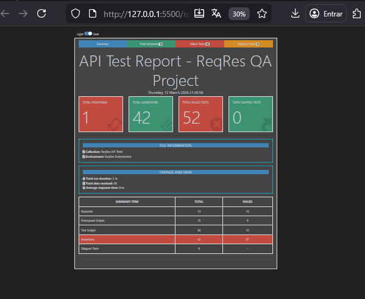

# API Tests - ReqRes

Projeto de **testes automatizados de API** utilizando **Postman** e
**Newman** para validar endpoints da API pública **ReqRes**.

Este projeto demonstra práticas de **Quality Assurance (QA)** como
organização de cenários de teste, validações automatizadas, execução via
CLI e geração de relatórios.

---

---

# Objetivo:

Validar o comportamento da API ReqRes garantindo que:

-   endpoints respondam com os **status codes corretos**
-   a **estrutura do JSON** esteja correta
-   campos obrigatórios estejam presentes
-   autenticação funcione corretamente
-   o **tempo de resposta da API** esteja dentro do esperado

---

# Cenários de teste:

## Users - Positive

-   GET - List Users
-   GET - Single User
-   POST - Create User
-   PUT - Update User
-   DELETE - User

## Users - Negative

-   GET - User Not Found

## Authentication - Positive

-   POST - Login Success
-   POST - Register Success

## Authentication - Negative

-   POST - Login Missing Password
-   POST - Register Missing Password

## Smoke Tests

Testes rápidos para verificar funcionamento básico da API.

---

# Execução dos testes:

## 1- Instalar dependências

    npm install

---

## 2- Executar testes via Newman

    npx newman run reqres-api-tests.postman_collection.json -e reqres-environment.postman_environment.json

---

## 3- Gerar relatório HTML

    npx newman run reqres-api-tests.postman_collection.json -e reqres-environment.postman_environment.json -r cli,htmlextra --reporter-htmlextra-export reports/newman-report.html

Após a execução será gerado:

    reports/newman-report.html

---

# Evidências de execução:

## Execução via Newman

## Relatório de testes

---

# Documentação:

Na pasta **docs** estão incluídos documentos comuns em projetos de QA:

-   **Test Plan** - planejamento da estratégia de testes
-   **Test Cases** - cenários detalhados de teste
-   **Bug Report** - exemplo de registro de defeito

---
---
---

🌸 Desenvolvido por Giovanna Fernandes
Estudante de Sistemas de Informação | QA
