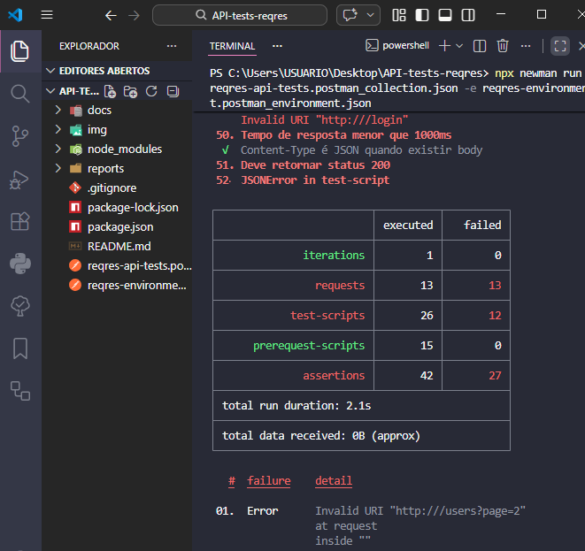

# Bug Report - Tempo de resposta acima do esperado no endpoint de login

Este documento apresenta um **exemplo de registro de defeito**
identificado durante a execução dos testes da API.

----

### ID:

🐞 BUG-0010

----

### Ambiente:

- Aplicação / API: ReqRes Demo API
- Endpoint testado: POST /login
- Ambiente: https://reqres.in
- Ferramenta de teste: Postman / Newman
- Node.js: v18+
- Sistema operacional: Windows

----

### Descrição:

Durante a execução dos testes automatizados de API foi identificado que o endpoint **POST /login** apresentou tempo de resposta acima do limite estabelecido nos testes.
Embora a requisição retorne **status 200** e o token esperado, o tempo de resposta ultrapassa o limite máximo definido de **1000ms**.

----

## Passos para reproduzir

1. Enviar uma requisição **POST** para o endpoint `/login`

2. Utilizar as seguintes credenciais:
   ```json
   {
     "email": "eve.holt@reqres.in",
     "password": "cityslicka"
   }

3.  Executar o teste utilizando **Postman ou Newman**

----

## Resultado atual:

-   Status Code **200**
-   Tempo de resposta **acima do limite definido**

----

### Resultado esperado:

-   Status Code **200**
-   Tempo de resposta **menor que 1000ms**
-   Token retornado no corpo da resposta

----

### Impacto:

O aumento no tempo de resposta do endpoint de login pode impactar a experiência do usuário, tornando o processo de autenticação mais lento.

Em cenários de alta carga, esse comportamento pode indicar possíveis problemas de performance na API, afetando a escalabilidade e a confiabilidade do sistema.

----

### Prioridade:

Média 🟠🟠🟠

----

### Evidência:

O comportamento foi identificado durante a execução automatizada dos testes via Newman.
A captura abaixo mostra o tempo de resposta acima do limite definido nos testes.



----

### Observação:

Apesar do endpoint retornar **status 200** e o token esperado, o tempo de resposta ultrapassou o limite estabelecido nos testes automatizados.

Esse comportamento pode estar relacionado a variações de desempenho do ambiente ou da infraestrutura da API durante a execução do teste.

----

## Root Cause (Possível causa):

A causa raiz não foi confirmada diretamente, pois a análise foi realizada do ponto de vista de testes automatizados e sem acesso à implementação interna da API.

Como hipótese, o tempo de resposta acima do limite pode estar associado a variações de desempenho do ambiente, latência de rede, sobrecarga momentânea do serviço ou processamento mais lento no endpoint de autenticação.

----
